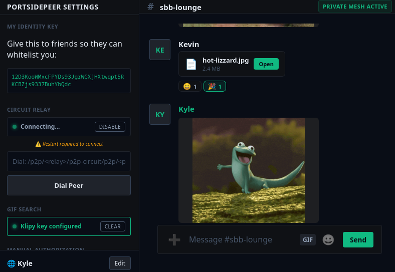

# PortsidePeer

Decentralized peer to peer chat app built for the user and not for data centers. It was built with local first in mind, you can use it on your local network without being connected to the world wide web. To use it over the www all you need is a relay!

### Features (so far)

- Automatically discover other PortsidePeer clients on the local network.
- All messages are encrypted by default with the NOISE protocol.
- Allow list based friend lists.
- Send gifs and paste gif urls. 
- React to messages with emojis, emoji search, etc.
- Send Files to everyone in the chatroom.
- Message history stored locally.

### How it works

Autodiscovery with mDNS on the local network via libp2p and relays for remote chat. When starting up PortsidePeer the node checks if a relay endpoint is saved for over the internet communication example `/ip4/ip-address/tcp/4001/p2p/relay-public-identity-id`, if there is no relay endpoint saved PortsidePeer runs over the local network only. Each friend you want to talk to needs to be added to the friend list via their public identity key in the top left corner. Once friends are added only those peers can read those messages. Please note the public identities need to be added to the local node as well as the relay node in use.

`Start PortsidePeer -> Add friend's public identity id to friend list -> Add a relay endpoint if sending messages over the internet`

### Running from source

After installing the prerequisites for Tauri clone the repo and run `npm run tauri dev`.

### Building from source

`npm run tauri build`

For some reason no Arch based distros this is needed.

`NO_STRIP=true npm run tauri build`

### Releases (soon)
